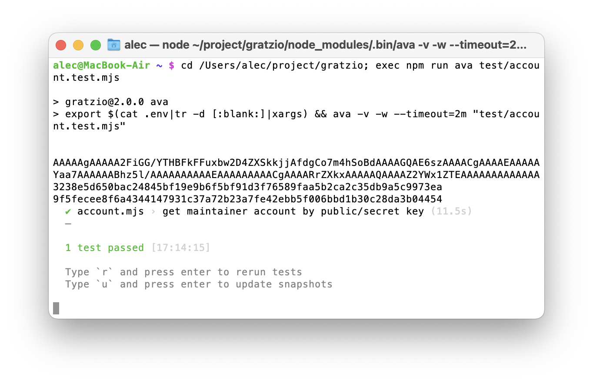
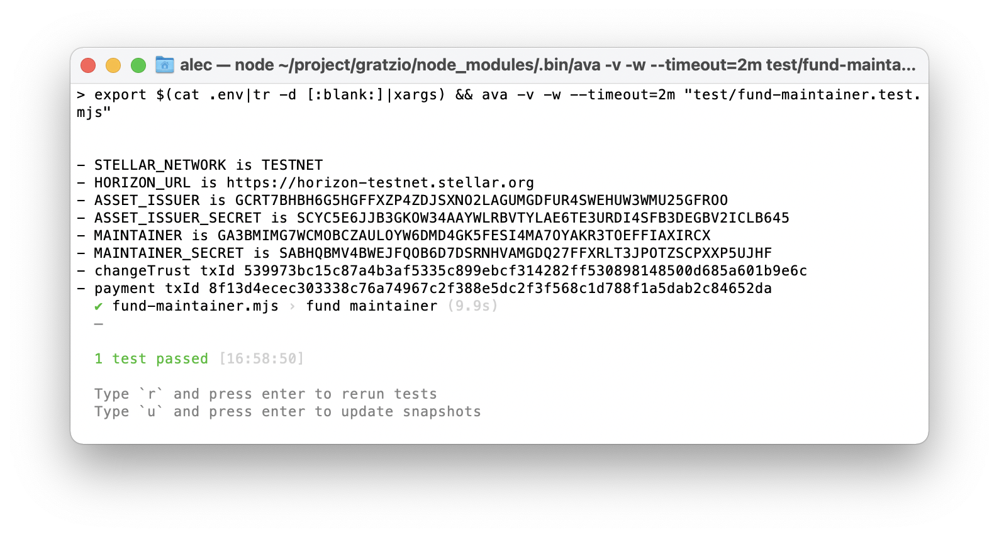
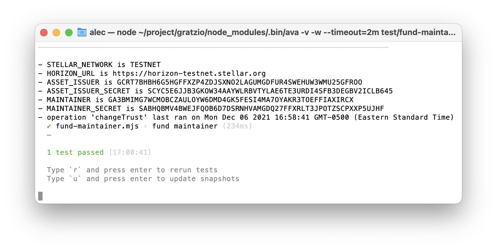
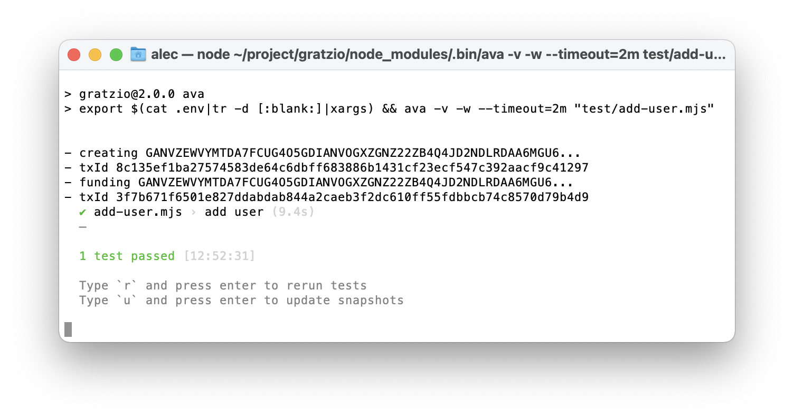

# 👷 gratzio
The gratz.io testbed

The project's goal is to establish a Distributed Autonomous Organization (DAO), whose members (users) exchange favors with each other. The DAO is [Stellar](https://stellar.org/)-based. To join it, the **user** clones and installs the [amissine/gratzio-join](https://github.com/amissine/gratzio-join) public repository. This results in a request for the **maintaner** to:

- create a Stellar account for the user;
- create a trustline from this account to the project's **asset issuer**;
- fund the account with the initial amount of the project's asset **GRAT**.

When the account is funded, its holder can do favors to other users for more GRAT, and/or send GRAT to other accounts in exchange of favors from their holders.

## Setup

Run

```bash
npm i && npm run init [ --run=<stellar_network> ]
```

and add public and secret keys for asset issuer and maintainer when prompted. 

The default value for *\<stellar_network\>* above is *testnet*. Alternatively, use *public*. Here's more on merging (TODO elaborate):


## Test case 0 - get maintainer account by public/secret key



## Test case 1 - fund maintainer

Fund maintainer with 1 billion GRAT. To do so, run

```bash
npm test --run=test/fund-maintainer.test.mjs
```

To locate and fix bugs, run

```bash
npx esbuild --outfile=dist/index.mjs --format=esm test/fund-maintainer.test.mjs
```




## Test case 2 - add user

Have maintainer:

- create an account for the user PK;
- fund user with 0 XLM;
- setup and authorize the trustline with GRAT asset issuer;
- fund user with 1000 GRAT.

To do so, run

```bash
npm test --run=test/add-user.mjs
```



## Test case 3 - exchange favors
