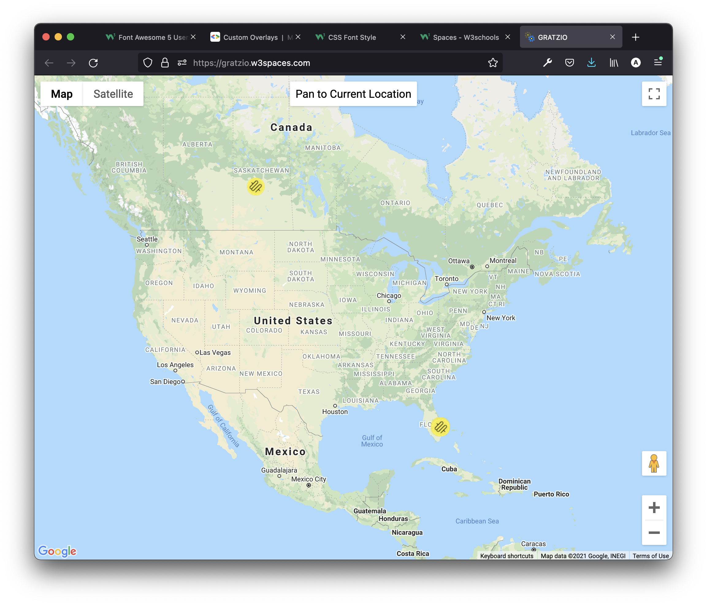
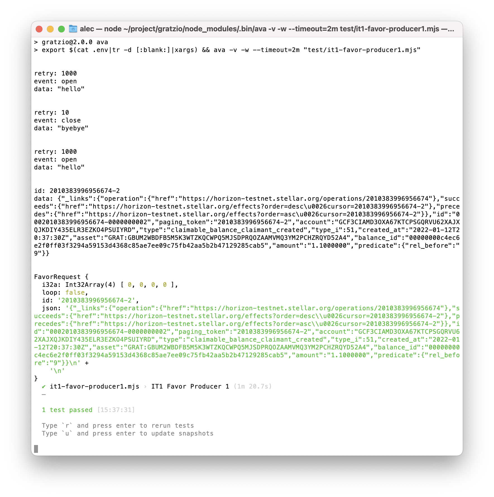

# 👷 gratzio
The gratz.io testbed. QA: [https://gratzio.w3spaces.com](https://gratzio.w3spaces.com)

The project's goal is to establish a Distributed Autonomous Organization (DAO), whose members (users) exchange favors with each other. The DAO is [Stellar](https://stellar.org/)-based. To join it, the **user** either uses the (QA) website, or clones and installs the [amissine/gratzio-join](https://github.com/amissine/gratzio-join) public repository. This results in a request for the **agent** to:

- create a Stellar account for the user;
- create a trustline from this account to the project's **GRAT issuer**;
- fund the account with the initial amount of the project's asset **GRAT**.

When the account is funded, its holder can do favors to other users for more GRAT, and/or send GRAT to other accounts in exchange of favors from their holders.

## Setup

If present, remove file `.env`. Run

```bash
npm i && npm run init [ --run=<stellar_network> ]
```

and add public and secret keys for GRAT issuer and agent when prompted. 

The default value for *\<stellar_network\>* above is *testnet*. Alternatively, use *public*.

If testing, run `./reset.sh`.

Here's more on merging (TODO elaborate):


## Test case 0 - get agent account by public/secret key


## Test case 1 - fund agent

Fund agent with 1 billion GRAT. To do so, run

```bash
npm test --run=test/fund-agent.mjs
```

To locate and fix bugs, run

```bash
npx esbuild --outfile=dist/index.mjs --format=esm test/fund-agent.mjs
```


## Test case 2 - add user

Have agent:

- create an account for the user PK;
- fund user with 0 XLM;
- setup and authorize the trustline with GRAT issuer;
- fund user with 1000 GRAT.

To do so, run

```bash
npm test --run=test/add-user.mjs
```


## Test case 3 - exchange favors

Exchange favors between the users.

```bash
npm run dev 
```


### Test case 3.1 - set locations

For all users, set their locations. To do so, run

```bash
npm test --run=test/set-locations.mjs
```


Then map users:


And Happy coming New 2022!



### Test case 3.2 - request favor

Select a user. Have the user request favor, wait 15 seconds, then reclaim the claimable balance.

```bash
npm test --run=test/request-favor.mjs
```

Test results:

```bash
> export $(cat .env|tr -d [:blank:]|xargs) && ava -v -w --timeout=2m "test/request-favor.mjs"


SD4DTYT4SB22YZUZIUVD4WR43YNWJQNSRK5X3MYOFUPITV3C6DH2ATA6
SBEJRMGJGWVME6UAXNHLSN3MXRV462JZY7UMXGHU3XCR2UP4POWZEDDS
SCTVVGWNZTELDZ6BITUCMKNJNLWKXY2QHX7Q4E3VA3NOCPLQBJU7IDMT
SD5PP5JP255R7EO567CAKWEWIEODO3UUF3ZCF6YIQ4BEOXSXCQUH4DKE
SAIFQIASW4FO5GB3A4ZX4HIDPJMU43K4YIUOIRVQ776DGEGODEUI2NFC
SDQ3UXFOZBWK3VQ7AOYN5DR3L4AUHZ4M72ZW4GBUH3KKIGMBKQUWQFCP
SAOLV6DATVACO7UZCJRVC6TLWV3TZZCH7QCKRQREYGC4P2LEFX6XTTVS
SC52B62CNWKYJ4OJKY7Y2QMMZ5UW3RM6TV7LV5JCRYYQXJZJY6OA2R6M
SAWOB63W5KY7SC5OEFNYS324F66I4T3FCFGNDBPD4RRAQPCLYMUERTKT
- add liquidity for user GA5RLKCWW7GQJYXLJLQGNGSSOTWWXIUUSG7XZNPPRN6GYOSSGF66MEKI signed by AGENT
d36035e334d58a30d22582a9f1b236e7999a0de0c4e12ce3ba3a0057b8d3ca4f
- tx signed and submitted by user
- clear liquidity data for user GA5RLKCWW7GQJYXLJLQGNGSSOTWWXIUUSG7XZNPPRN6GYOSSGF66MEKI signed by AGENT
030e1fb2ed4f634901577b0b0d4f22d9abb5c3fa3f1cf6ec3205800d2aa2d5c7
- tx signed and submitted by user
- remove liquidity for user GA5RLKCWW7GQJYXLJLQGNGSSOTWWXIUUSG7XZNPPRN6GYOSSGF66MEKI signed by AGENT
0bfbf4bd140fd886aedfd2fc575ba4bb909a8d669109c7f290981d8929b9975d
- txId signed and submitted by user
  ✔ request-favor.mjs › request favor (32s)
  ─

  1 test passed [16:01:56]
```

### Test case 3.3 - collect liquidity

Starting with

```bash
https://horizon-testnet.stellar.org/accounts/GCF3CIAMD3OXA67KTCPSGQRVU62XAJXQJKDIY435ELR3EZKO4PSUIYRD/effects?cursor=now&order=desc
```

, go back and collect ALL claimable `FavorRequest`/`FavorOffer` instances.

```bash
npm test --run=test/collect-liquidity.mjs
```

Test results (cut):

```bash
...
1578855747821570-2
[
  {
    _links: { operation: [Object], succeeds: [Object], precedes: [Object] },
    id: '0001578855747821570-0000000002',
    paging_token: '1578855747821570-2',
    account: 'GCF3CIAMD3OXA67KTCPSGQRVU62XAJXQJKDIY435ELR3EZKO4PSUIYRD',
    type: 'claimable_balance_claimant_created',
    type_i: 51,
    created_at: '2022-01-06T17:59:06Z',
    asset: 'GRAT:GBUM2WBDFB5M5K3WTZKQCWPQ5MJSDPRQOZAAMVMQ3YM2PCHZRQYD52A4',
    balance_id: '000000007658121f80611e7c7984d35da1ada0fa897fee69a2e1b8f83ee9d1aa45426f8e',
    amount: '1.1000000',
    predicate: { rel_before: '9' }
  },
  {
    _links: { operation: [Object], succeeds: [Object], precedes: [Object] },
    id: '0001578671064223746-0000000002',
    paging_token: '1578671064223746-2',
    account: 'GCF3CIAMD3OXA67KTCPSGQRVU62XAJXQJKDIY435ELR3EZKO4PSUIYRD',
    type: 'claimable_balance_claimant_created',
    type_i: 51,
    created_at: '2022-01-06T17:55:23Z',
    asset: 'GRAT:GBUM2WBDFB5M5K3WTZKQCWPQ5MJSDPRQOZAAMVMQ3YM2PCHZRQYD52A4',
    balance_id: '00000000856640256fa68771a5ea8ab97ee4a882a0d3a5cc39eb6ab48e61d68b94e06bb5',
    amount: '1.1000000',
    predicate: { rel_before: '9' }
  },
  {
    _links: { operation: [Object], succeeds: [Object], precedes: [Object] },
    id: '0001575376824311810-0000000002',
    paging_token: '1575376824311810-2',
    account: 'GCF3CIAMD3OXA67KTCPSGQRVU62XAJXQJKDIY435ELR3EZKO4PSUIYRD',
    type: 'claimable_balance_claimant_created',
    type_i: 51,
    created_at: '2022-01-06T16:47:59Z',
    asset: 'GRAT:GBUM2WBDFB5M5K3WTZKQCWPQ5MJSDPRQOZAAMVMQ3YM2PCHZRQYD52A4',
    balance_id: '00000000900cf046308f152393b1aa3f2720fff731136adacb26ae4fa1fca42c5c73a6a7',
    amount: '1.1000000',
    predicate: { rel_before: '9' }
  },
  {
    _links: { operation: [Object], succeeds: [Object], precedes: [Object] },
    id: '0001575303809867778-0000000002',
    paging_token: '1575303809867778-2',
    account: 'GCF3CIAMD3OXA67KTCPSGQRVU62XAJXQJKDIY435ELR3EZKO4PSUIYRD',
    type: 'claimable_balance_claimant_created',
    type_i: 51,
    created_at: '2022-01-06T16:46:32Z',
    asset: 'GRAT:GBUM2WBDFB5M5K3WTZKQCWPQ5MJSDPRQOZAAMVMQ3YM2PCHZRQYD52A4',
    balance_id: '000000008cb02d4c904717833a2c21132a2e1af29af1c7bbbcfba6de47ad01052516073c',
    amount: '1.1000000',
    predicate: { rel_before: '9' }
  },
  {
    _links: { operation: [Object], succeeds: [Object], precedes: [Object] },
    id: '0001575020342026242-0000000002',
    paging_token: '1575020342026242-2',
    account: 'GCF3CIAMD3OXA67KTCPSGQRVU62XAJXQJKDIY435ELR3EZKO4PSUIYRD',
    type: 'claimable_balance_claimant_created',
    type_i: 51,
    created_at: '2022-01-06T16:40:51Z',
    asset: 'GRAT:GBUM2WBDFB5M5K3WTZKQCWPQ5MJSDPRQOZAAMVMQ3YM2PCHZRQYD52A4',
    balance_id: '00000000045d5b5b72c429980705d20089966ffca392c2525f7fe0732cf114a7a038d8af',
    amount: '1.1000000',
    predicate: { rel_before: '9' }
  },
  {
    _links: { operation: [Object], succeeds: [Object], precedes: [Object] },
    id: '0001574882903072770-0000000002',
    paging_token: '1574882903072770-2',
    account: 'GCF3CIAMD3OXA67KTCPSGQRVU62XAJXQJKDIY435ELR3EZKO4PSUIYRD',
    type: 'claimable_balance_claimant_created',
    type_i: 51,
    created_at: '2022-01-06T16:37:59Z',
    asset: 'GRAT:GBUM2WBDFB5M5K3WTZKQCWPQ5MJSDPRQOZAAMVMQ3YM2PCHZRQYD52A4',
    balance_id: '000000000baf12b1424a4360fd57cc6ed7b7b18c21f1e1805aa447ef6681faec174b11a8',
    amount: '1.1000000',
    predicate: { rel_before: '9' }
  },
  {
    _links: { operation: [Object], succeeds: [Object], precedes: [Object] },
    id: '0001574092629094402-0000000002',
    paging_token: '1574092629094402-2',
    account: 'GCF3CIAMD3OXA67KTCPSGQRVU62XAJXQJKDIY435ELR3EZKO4PSUIYRD',
    type: 'claimable_balance_claimant_created',
    type_i: 51,
    created_at: '2022-01-06T16:21:52Z',
    asset: 'GRAT:GBUM2WBDFB5M5K3WTZKQCWPQ5MJSDPRQOZAAMVMQ3YM2PCHZRQYD52A4',
    balance_id: '000000003e0f26c13a681dd36df3188bf5dcaef0de9c90c5328cd57e170757925e8fcded',
    amount: '1.1000000',
    predicate: { rel_before: '9' }
  },
  {
    _links: { operation: [Object], succeeds: [Object], precedes: [Object] },
    id: '0001573263700398082-0000000002',
    paging_token: '1573263700398082-2',
    account: 'GCF3CIAMD3OXA67KTCPSGQRVU62XAJXQJKDIY435ELR3EZKO4PSUIYRD',
    type: 'claimable_balance_claimant_created',
    type_i: 51,
    created_at: '2022-01-06T16:05:04Z',
    asset: 'GRAT:GBUM2WBDFB5M5K3WTZKQCWPQ5MJSDPRQOZAAMVMQ3YM2PCHZRQYD52A4',
    balance_id: '000000009aaff2676adc8103e094d621c0f739b22fae32aa3a16e23e0b389622a2c9b485',
    amount: '1.1000000',
    predicate: { rel_before: '9' }
  },
  {
    _links: { operation: [Object], succeeds: [Object], precedes: [Object] },
    id: '0001573225045692418-0000000002',
    paging_token: '1573225045692418-2',
    account: 'GCF3CIAMD3OXA67KTCPSGQRVU62XAJXQJKDIY435ELR3EZKO4PSUIYRD',
    type: 'claimable_balance_claimant_created',
    type_i: 51,
    created_at: '2022-01-06T16:04:17Z',
    asset: 'GRAT:GBUM2WBDFB5M5K3WTZKQCWPQ5MJSDPRQOZAAMVMQ3YM2PCHZRQYD52A4',
    balance_id: '00000000338ad5149445a1966b998a691d29251e7b6251e3bd61b8bb8d2774e51b4f1aa6',
    amount: '1.1000000',
    predicate: { rel_before: '9' }
  },
  {
    _links: { operation: [Object], succeeds: [Object], precedes: [Object] },
    id: '0001573031772164098-0000000002',
    paging_token: '1573031772164098-2',
    account: 'GCF3CIAMD3OXA67KTCPSGQRVU62XAJXQJKDIY435ELR3EZKO4PSUIYRD',
    type: 'claimable_balance_claimant_created',
    type_i: 51,
    created_at: '2022-01-06T16:00:20Z',
    asset: 'GRAT:GBUM2WBDFB5M5K3WTZKQCWPQ5MJSDPRQOZAAMVMQ3YM2PCHZRQYD52A4',
    balance_id: '000000005c86c8dda25a7b4821067d3e2ac7a2a8643aaee7c324830c234c36084f7315ae',
    amount: '1.1000000',
    predicate: { rel_before: '9' }
  }
]
1578671064223746-2
[
  {
    _links: { operation: [Object], succeeds: [Object], precedes: [Object] },
    id: '0001578671064223746-0000000002',
    paging_token: '1578671064223746-2',
    account: 'GCF3CIAMD3OXA67KTCPSGQRVU62XAJXQJKDIY435ELR3EZKO4PSUIYRD',
    type: 'claimable_balance_claimant_created',
    type_i: 51,
    created_at: '2022-01-06T17:55:23Z',
    asset: 'GRAT:GBUM2WBDFB5M5K3WTZKQCWPQ5MJSDPRQOZAAMVMQ3YM2PCHZRQYD52A4',
    balance_id: '00000000856640256fa68771a5ea8ab97ee4a882a0d3a5cc39eb6ab48e61d68b94e06bb5',
    amount: '1.1000000',
    predicate: { rel_before: '9' }
  },
  {
    _links: { operation: [Object], succeeds: [Object], precedes: [Object] },
    id: '0001575376824311810-0000000002',
    paging_token: '1575376824311810-2',
    account: 'GCF3CIAMD3OXA67KTCPSGQRVU62XAJXQJKDIY435ELR3EZKO4PSUIYRD',
    type: 'claimable_balance_claimant_created',
    type_i: 51,
    created_at: '2022-01-06T16:47:59Z',
    asset: 'GRAT:GBUM2WBDFB5M5K3WTZKQCWPQ5MJSDPRQOZAAMVMQ3YM2PCHZRQYD52A4',
    balance_id: '00000000900cf046308f152393b1aa3f2720fff731136adacb26ae4fa1fca42c5c73a6a7',
    amount: '1.1000000',
    predicate: { rel_before: '9' }
  },
  {
    _links: { operation: [Object], succeeds: [Object], precedes: [Object] },
    id: '0001575303809867778-0000000002',
    paging_token: '1575303809867778-2',
    account: 'GCF3CIAMD3OXA67KTCPSGQRVU62XAJXQJKDIY435ELR3EZKO4PSUIYRD',
    type: 'claimable_balance_claimant_created',
    type_i: 51,
    created_at: '2022-01-06T16:46:32Z',
    asset: 'GRAT:GBUM2WBDFB5M5K3WTZKQCWPQ5MJSDPRQOZAAMVMQ3YM2PCHZRQYD52A4',
    balance_id: '000000008cb02d4c904717833a2c21132a2e1af29af1c7bbbcfba6de47ad01052516073c',
    amount: '1.1000000',
    predicate: { rel_before: '9' }
  },
  {
    _links: { operation: [Object], succeeds: [Object], precedes: [Object] },
    id: '0001575020342026242-0000000002',
    paging_token: '1575020342026242-2',
    account: 'GCF3CIAMD3OXA67KTCPSGQRVU62XAJXQJKDIY435ELR3EZKO4PSUIYRD',
    type: 'claimable_balance_claimant_created',
    type_i: 51,
    created_at: '2022-01-06T16:40:51Z',
    asset: 'GRAT:GBUM2WBDFB5M5K3WTZKQCWPQ5MJSDPRQOZAAMVMQ3YM2PCHZRQYD52A4',
    balance_id: '00000000045d5b5b72c429980705d20089966ffca392c2525f7fe0732cf114a7a038d8af',
    amount: '1.1000000',
    predicate: { rel_before: '9' }
  },
  {
    _links: { operation: [Object], succeeds: [Object], precedes: [Object] },
    id: '0001574882903072770-0000000002',
    paging_token: '1574882903072770-2',
    account: 'GCF3CIAMD3OXA67KTCPSGQRVU62XAJXQJKDIY435ELR3EZKO4PSUIYRD',
    type: 'claimable_balance_claimant_created',
    type_i: 51,
    created_at: '2022-01-06T16:37:59Z',
    asset: 'GRAT:GBUM2WBDFB5M5K3WTZKQCWPQ5MJSDPRQOZAAMVMQ3YM2PCHZRQYD52A4',
    balance_id: '000000000baf12b1424a4360fd57cc6ed7b7b18c21f1e1805aa447ef6681faec174b11a8',
    amount: '1.1000000',
    predicate: { rel_before: '9' }
  },
  {
    _links: { operation: [Object], succeeds: [Object], precedes: [Object] },
    id: '0001574092629094402-0000000002',
    paging_token: '1574092629094402-2',
    account: 'GCF3CIAMD3OXA67KTCPSGQRVU62XAJXQJKDIY435ELR3EZKO4PSUIYRD',
    type: 'claimable_balance_claimant_created',
    type_i: 51,
    created_at: '2022-01-06T16:21:52Z',
    asset: 'GRAT:GBUM2WBDFB5M5K3WTZKQCWPQ5MJSDPRQOZAAMVMQ3YM2PCHZRQYD52A4',
    balance_id: '000000003e0f26c13a681dd36df3188bf5dcaef0de9c90c5328cd57e170757925e8fcded',
    amount: '1.1000000',
    predicate: { rel_before: '9' }
  },
  {
    _links: { operation: [Object], succeeds: [Object], precedes: [Object] },
    id: '0001573263700398082-0000000002',
    paging_token: '1573263700398082-2',
    account: 'GCF3CIAMD3OXA67KTCPSGQRVU62XAJXQJKDIY435ELR3EZKO4PSUIYRD',
    type: 'claimable_balance_claimant_created',
    type_i: 51,
    created_at: '2022-01-06T16:05:04Z',
    asset: 'GRAT:GBUM2WBDFB5M5K3WTZKQCWPQ5MJSDPRQOZAAMVMQ3YM2PCHZRQYD52A4',
    balance_id: '000000009aaff2676adc8103e094d621c0f739b22fae32aa3a16e23e0b389622a2c9b485',
    amount: '1.1000000',
    predicate: { rel_before: '9' }
  },
  {
    _links: { operation: [Object], succeeds: [Object], precedes: [Object] },
    id: '0001573225045692418-0000000002',
    paging_token: '1573225045692418-2',
    account: 'GCF3CIAMD3OXA67KTCPSGQRVU62XAJXQJKDIY435ELR3EZKO4PSUIYRD',
    type: 'claimable_balance_claimant_created',
    type_i: 51,
    created_at: '2022-01-06T16:04:17Z',
    asset: 'GRAT:GBUM2WBDFB5M5K3WTZKQCWPQ5MJSDPRQOZAAMVMQ3YM2PCHZRQYD52A4',
    balance_id: '00000000338ad5149445a1966b998a691d29251e7b6251e3bd61b8bb8d2774e51b4f1aa6',
    amount: '1.1000000',
    predicate: { rel_before: '9' }
  },
  {
    _links: { operation: [Object], succeeds: [Object], precedes: [Object] },
    id: '0001573031772164098-0000000002',
    paging_token: '1573031772164098-2',
    account: 'GCF3CIAMD3OXA67KTCPSGQRVU62XAJXQJKDIY435ELR3EZKO4PSUIYRD',
    type: 'claimable_balance_claimant_created',
    type_i: 51,
    created_at: '2022-01-06T16:00:20Z',
    asset: 'GRAT:GBUM2WBDFB5M5K3WTZKQCWPQ5MJSDPRQOZAAMVMQ3YM2PCHZRQYD52A4',
    balance_id: '000000005c86c8dda25a7b4821067d3e2ac7a2a8643aaee7c324830c234c36084f7315ae',
    amount: '1.1000000',
    predicate: { rel_before: '9' }
  },
  {
    _links: { operation: [Object], succeeds: [Object], precedes: [Object] },
    id: '0001525366225113090-0000000005',
    paging_token: '1525366225113090-5',
    account: 'GCF3CIAMD3OXA67KTCPSGQRVU62XAJXQJKDIY435ELR3EZKO4PSUIYRD',
    type: 'claimable_balance_sponsorship_created',
    type_i: 69,
    created_at: '2022-01-05T23:47:24Z',
    balance_id: '00000000bb468d1981a7b8247f167ee2e42e69a72abcada2529045ce4eadde6854ac2792',
    sponsor: 'GCF3CIAMD3OXA67KTCPSGQRVU62XAJXQJKDIY435ELR3EZKO4PSUIYRD'
  }
]
  ✔ collect-liquidity.mjs › collect liquidity (5.3s)
  ─

  1 test passed [16:05:01]

```

```bash
> export $(cat .env|tr -d [:blank:]|xargs) && ava -v -w --timeout=2m "test/collect-liquidity.mjs"


Favor description goes here.
    Favor description consists of one or more lines of text.
    The total length of the text is limited to 2000 characters.
  ✔ collect-liquidity.mjs › collect liquidity (516ms)
  ─

  1 test passed [15:49:09]

```

### Test case 3.4 - request/bid/accept/produce favor (integration test 1)

There are 3 actors in this test:

- Favor Requestor;
- Favor Producer 1; and
- Favor Producer 2.

The test kicks off when Favor Producer 1 starts looking for favor requests. It finds no existing requests in the past, and continues to wait for a future request.

Three seconds pass, and Favor Requestor makes a request and starts waiting for bids. Favor Producer 1 bids on the request right away, then continues to wait for Favor Requestor to accept the bid. Favor Requestor receives the bid and deliberates on it.

Two seconds pass, and Favor Producer 2 starts looking for favor requests. It finds the existing request and bids on it, then continues to wait for Favor Requestor to accept the bid. Favor Requestor receives the bid and deliberates on it.

One second passes, and Favor Requestor decides to accept the bid from Favor Producer 2, and sets aside GRATs to be collected by Favor Producer 2 after the favor is produced. Favor Producer 2 gets notified, produces the favor and collects GRATs. THE END

Confirming successful test of wait/notify functionality:

